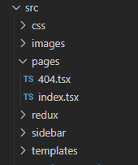
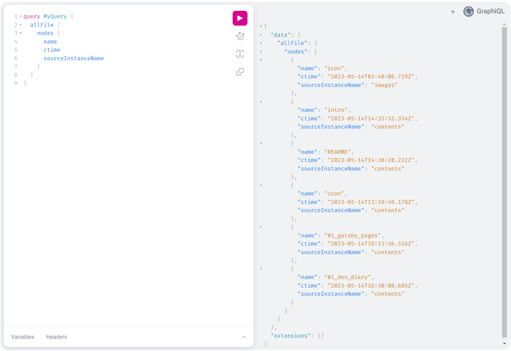
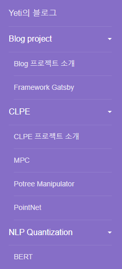

## **프레임워크 선정**

추후에 three.js를 이용하여 point cloud 데이터를 visualization 하는 기능을 추가하기 위해 기존에 익숙하였던 React 프레임워크로 개발을 진행하려 하였다. 그러다 정적 사이트 생성이 가능하고 React를 기반으로 하는 [Gatsby](https://www.gatsbyjs.com/) 라는 프레임워크를 알게 되었다. 이를 github pages와 함께 활용하면 markdown 파일 작성만으로 페이지를 쉽게 생성할 수 있을 것이다.

튜토리얼을 따라하며 기본적인 사용 방법을 익혔다. Gatsby는 기본적으로 src/pages에 있는 React 파일을 pages로 생성한다.



위 사진처럼 작성할 시 404와 index 페이지가 생성된다.

Gatsby에서는 query를 통해 데이터를 가져올 수 있다. 아래와 같이 query를 요청하고 props로 받아올 수 있다.
```typescript
    // 요청한 query에 대해 props로 받는다
    const IndexPage = ({ data }: PageProps<QueryProps>) => {
        const html = data.markdownRemark.html
    }

    export const query = graphql
    `{
        markdownRemark() {
            html
            frontmatter {
                title
                date
                categories
                summary
            }
        }
    }`
```

개발 단계에서 query에 대한 테스트는 [localhost:8000/___graphql](http://localhost:8000/___graphql) 에서 할 수 있다.



테스트로 gh-pages로 deploy를 진행하였더니 404 에러가 발생하였다. 원인을 찾은 결과 local에서는 https://localhost:8000 으로 접속하였으나, gh-pages 이용해 배포한 환경은 [https://yeti-s.github.io/blog](https://yeti-s.github.io/blog)로 항상 repository name이 붙어있다. 따라서 gatsby-config으로 path prefix 설정을 해주었다.

```typescript
// gatsby-config.ts
const config: GatsbyConfig = {
    ...
    pathPrefix: "/blog"
    ...
}
// package.json
"scripts": {
    ...
    "build": "gatsby build --prefix-paths",
    "serve": "gatsby serve --prefix-paths",
}
```

build와 serve에 각각 설정해준 --prefix-paths 옵션을 함께 추가하고 배포를 진행하여 문제를 해결할 수 있었다. 

사실 gatsby-config에 siteMetadata라는 옵션을 함께 설정해주었으나, 설정 값이 pathPrefix와 충돌이 있는 것인지 webpack.js 요청을 실패하는 경우가 발생하여 siteMetadata 옵션을 제거하였다.

## **템플릿**

Gatsby에서는 다양한 [템플릿](https://www.gatsbyjs.com/starters/)을 제공하였다. 템플릿을 이용해 프로젝트를 생성할 수 있었다.

```typescript
$ gatsby new [프로젝트명] [템플릿 주소]
```

그러나 템플릿의 대부분이 node v16 까지만 지원하는 것이 많았다. 블로그에 알맞는 템플릿을 찾던 중, node v18을 지원하는 [rocketdocs](https://github.com/jpedroschmitz/rocketdocs)라는 템플릿을 발견하였다. 기존 목적인 markdown 파일 작성만으로 페이지 생성을 쉽게 할 수 있고 docs 형식으로 프로젝트 진행 중 학습한 내용, 진행 과정 등을 남기기 좋을 것 같아 채택해보았다. 하지만 customize하기 어렵다는 문제가 있었다. 대부분의 템플릿에 해당하는 문제였기에 템플릿을 포기하고 직접 구현하기로 하였다.

## **페이지 생성**

Gatsby는 src/pages에 tsx파일을 page로 생성한다고 하였다. 그럼 .md 파일을 작성할 때 마다 tsx파일을 생성해야 하는가? 다행이도 Gatsby에는 프로그램적으로 페이지를 생성하는 방법이 있다.

[Part 6: Create Pages Programmatically](https://www.gatsbyjs.com/docs/tutorial/getting-started/part-6/)

1. gatsby-transformer-remark 플러그인을 설치한다.
   ```
   npm i gatsby-transformer-remark
   ```
2. gatsby-config에서 gatsby-transformer-remark 플러그인을 설정한다.
   ```typescript
    // gatsby-config.ts
    const config: GatsbyConfig = {
        ...
        resolve: "gatsby-transformer-remark",
        option:{
            ... // gatsby-transformer-remark 관련 플러그인
        }
    }
   ```
3. template 파일을 생성
    ```typescript
    // 생성할 페이지의 react element
    const IndexPage = ({ data }: PageProps<QueryProps>) => {
        const node = data.markdownRemark
        ...
    }

    // id는 gatsby-node.ts에서 받아옴 아래 보면 알게됨
    export const query = graphql
    `query($id: String!) {
        markdownRemark(id:{ eq: $id }) {
                html
                frontmatter {
                    title
                    date
                    categories
                    summary
                }
        }
    }`
    ```

    frontmatter의 객체는 .md 파일에서 아래 key 값들에 해당한다.
    ```
    ---
    title: 'Gatsby and React'
    date: '2023-05-15'
    categories: ['blog', 'gatsby', 'dev']
    summary: 'Blog 1일차 개발 일지.'
    thumbnail: '../assets/icon.png'
    menu: 'blog'
    path: '/yeti_blog/intro'
    ---
    ```

4. root dir에 gatsby-node.ts 파일을 생성한다.
    ```typescript
    import { GatsbyNode, graphql } from "gatsby";
    import {resolve} from 'path'

    const createPages: GatsbyNode["createPages"] = async ({graphql, actions}) => {
        const {createPage} = actions;

        // markdown 파일에 대해 query 요청
        const result = await graphql<any>(`
        {
            allMarkdownRemark {
                edges {
                    node {
                        id
                        frontmatter {
                            path
                        }
                    }
                }
            }
        }
        `);

    result.data.allMarkdownRemark.edges.forEach(({node}: any) => {
            createPage({
                // page의 path가 되는 부분
                path: node.frontmatter.path, 
                // 생성할 page의 template
                component: resolve('./src/templates/MdContents.tsx'),
                // 템플릿에 전달할 내용들
                context:{
                    id: node.id
                }
            })
            
        })

    }

    export {createPages}
    ```
위 방법으로 contents 폴더에 있는 .md 파일을 읽고 페이지로 생성한다.

## Markdown, File system

markdown query로 sidebar를 생성할 경우 아래와 같이 많은 metadata가 필요하다. 데이터를 생성하고 수정할 때 마다 변경해 주는 것이 비효율적인 것 같아 file system과 연동할 수 있는 부분은 제거하려고 한다.

```
---
title: '프로젝트 소개'
date: '2023-05-14'
categories: ['blog', 'intro']
summary: '학습 진도 설정 및 확인, 기술 스택 메모등을 위한 블로그를 생성하는 프로젝트이다.'
thumbnail: '../assets/icon.png'
menu: 'blog'
path: '/yeti_blog/intro'
---
```

date, menu, path 등은 각각 file의 생성 날짜, 상위 dir 이름, 상대 경로로 대체할 수 있다. 

```typescript
`
allMarkdownRemark {
    nodes {
        id
        fileAbsolutePath
        frontmatter {
            title
        }
    }
}
allFile {
    nodes {
        name
        birthTime(formatString: "YYYY-MM-DD hh:mm:ss")
        ctime(formatString: "YYYY-MM-DD hh:mm:ss")
        relativeDirectory
        absolutePath
    }
}
`
```

위와 같이 커ㅜ리를 추가하고 allFile과 allMarkdownRemark의 필요한 정보를 모아 sidebar를 구성한다. 

테스트를 하다 보니 sidebar item들의 순서가 섞이는 현상이 있었다. 이를 위해 규칙을 정하고 sort해서 render하기로 하였다. 목록의 표시하고 싶은 순서대로 contents의 파일명을 00_filename.md, 01_filename.md 등으로 두고 filename을 토대로 menu 내에서 sort 하기로 하였다.

```typescript
// sort menu items
nodes.forEach((files, key, obj) => {
    files.sort((item1, item2):number => {
        if (item1['filename'] > item2['filename']) return 1;
        return -1;
    })
})
```



잘 된 것 같다.
