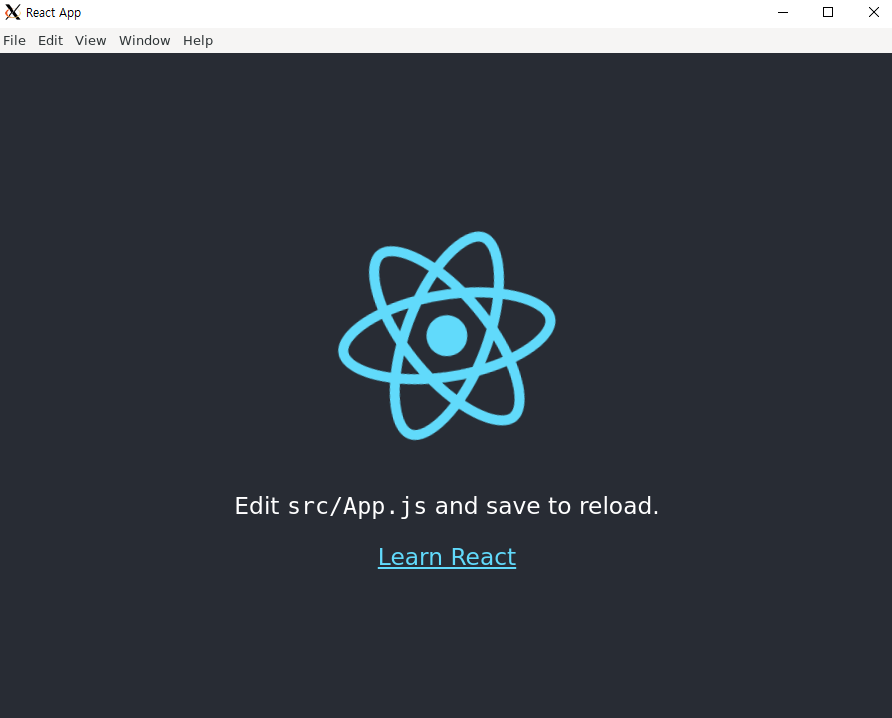
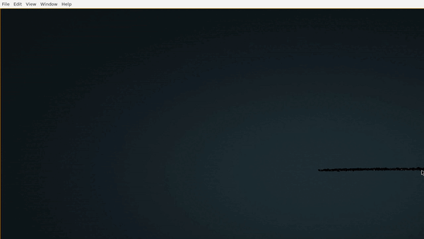
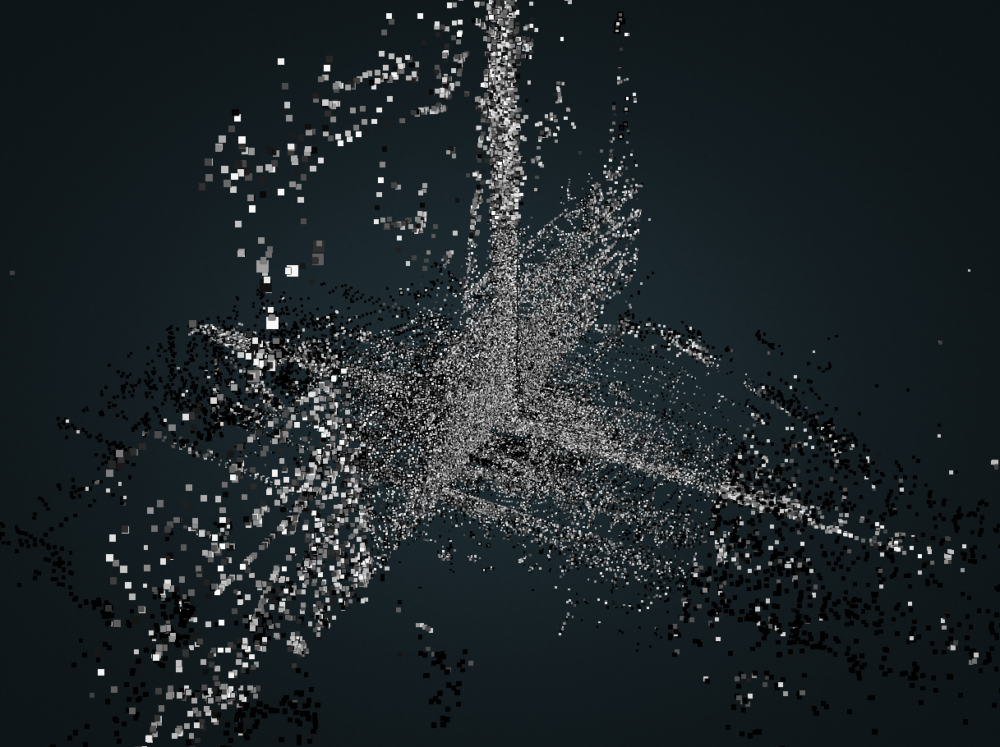
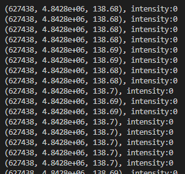

Pointcloud 데이터를 사용자의 요청대로 조작할 수 있는 lib 형태의 프로그램을 제작한다.

## 배경 지식
### Potree
> point cloud octree로 point cloud 데이터를 octree의 형태로 쪼개어 render 하는 형식.


## 학습 데이터 구축

사진1(도로 표시가 있는 작은 point cloud 데이터) -> 사진2(도로 표시의 boundary 내에만 존재하는 point cloud 데이터와 boundary 데이터)


## 필요한 기술 스택
* libary to manipulate point cloud data (c++)
* electron <-> file system access (js)
* call c lib from js (js)


# 개발 순서

## 1. Electron & React 

> 로컬 환경에서 어플리케이션으로 구동 가능하도록 Electron에 react를 올려 사용할 것이다. 또 three.js 나 potree-core 등 point cloud loading에 필요한 패키지도 함께 설정하자.

> C++ 개발과 동시에 진행하기 떄문에 wsl 환경에서 진행 할 것인데, GUI 문제가 있으므로 X-server등을 잘 활용해서 환경을 만들어 두자!. 나는 VcXsrv 사용했다.



기본 index 페이지에서 부터 point cloud 화면을 띄울 수 있도록 3D canvas로 만들자. point cloud 데이터를 file system에서 가져오기 위해서는 electron 과 renderer의 ipc(inter-process communication)가 필요하다.
```javascript
// renderer.jsx
import {ipcRenderer} = window.require('electron');
```

window.require is not a function 오류가 발생한다면 아래와 같이 main.js에 추가해주자.
```javascript
function createWindow() {
    ...
    webPreferences: {
        ...
        // TypeError: window.require is not a function 일때 추가
        contextIsolation: false
    }
};
```

potree-core의 loadPointCloud 함수 내부 여러 데이터를 load하기 위한 함수로 fetch를 사용한다. 

```javascript
// https://github.com/tentone/potree-core/blob/master/source/loading2/OctreeLoader.ts#L284
let response = await fetch(hierarchyPath, {
    headers: {
        'content-type': 'multipart/byteranges',
        'Range': `bytes=${first}-${last}`
    }
});
```

하지만 electron의 renderer는 직접접으로 file system에 접근할 수 없기 때문에 이를 ipcRenderer, ipcMain으로 대체해야 한다. potree-core 내부 소스 코드를 수정해야하니 npm 으로 모듈을 설치하지 말고 git으로 코드를 가져오자. ipc로 fetch와 xphRequest를 대체하였으나, 모듈에서 구현된 소스코드가 적어 시간이 많이 소요될 것으로 예상, PotreeDesktop의 구조처럼 사용하기로 결정했다.

레포지토리 다시 파자,, file system에 접근하기 위해 window.fetch를 IPC.Renderer 함수로 덮어씌워버리는 무식한 방법을 사용해서 테스트를 해보았다.
```javascript
const fetchFile = (path, headers) => {
    return new Promise((resovle, reject)=> {
        ipcRenderer.invoke('fetch-file', path, headers).then((res) => {
            resovle(new Response(res))
        })
    })
}
window.fetch = fetchFile;
```



너무 느리다. ipc 통신이 http통신보다 더 느린가보다. 일단 바쁘니 나중에 비교하자. expressjs로 file을 serve하는 간단한 기능을 가진 서버를 구축해서 electron을 제거하고 다시 시작해보자. 창 여러개 띄우고 실행할 수 있으니 이게 더 좋은 방법일수도 있겠다. 개발 환경에서도 로딩이 느린 문제가 있었는데 빌드 하고 배포한 환경에서 시작을 해보니 잘 작동한다.

해당 프로그램의 목적은 아래와 같다.
* ### (x, y, z) 범위 내부의 pointcloud 데이터만 가시화하기 
학습 모델의 train 데이터의 범위를 줄이고, local 단위 학습을 먼저 진행하기 위해서 pointcloud 데이터를 원하는 범위만큼 잘라내는 기술이 필요하다. 해당 요청을 위해 지정한 범위 내부의 pointcloud만 보이는 기술을 구현해야 한다. PotreeDesktop 에서 이미 아래 사진과 같은 Clipping Volume 이라고 지원하고 있다. 이를 조금 가공하여 써먹기 쉽도록 구현해보자. volume은 4x4 행렬의 형태로 [Transform matrix](https://en.wikipedia.org/wiki/Transformation_matrix) 형태라고 한다. 행렬을 통해 shader에서 연산을 통해 내부에 있는지 없는지 계산하는 것 같다.


* ### intensity 한계점 이상의 pointcloud 데이터만 가시화하기
학습 모델의 target을 획득하기 위해 intensity의 threshold가 필요하다. threshold 이상의 intensity를 가진 pointcloud 데이터를 가시화할 수 있는 기능을 구현하여 학습의 target이 될 intensity의 threshold 값과, 해당하는 pointcloud의 범위를 찾아낼 수 있다. 위 volume을 통한 clipping 코드에서 intensity attribute에 대하여 추가해주자. viewer, octree, material 등에 intensity filter 값을 추가하고 shader에 아래 내용을 추가하자.
```C
#if defined(clip_intensity_enabled)
{ // intensity filter
    float threshold = uFilterIntensity;
    
    if (intensity < threshold) {
        gl_Position = vec4(100.0, 100.0, 100.0, 0.0);
        return;
    }
}
#endif
```
그리고 potree renderer에 해당 shader가 사용될 수 있도록 코드를 추가해주면 완성이다. 이 부분은 shader와 여러 소스 코드들을 직접 수정해야할 필요가 있으므로 [potree](https://github.com/potree/potree)에서 소스를 받아와서 수정하고 빌드한 후 react에 붙이는 방식으로 사용하자


1. find lidar open dataset.

* [KITTI](https://www.cvlibs.net/datasets/kitti/eval_object.php?obj_benchmark=3d)
> 
> 용량이 29GB나 되니 여유 있을때 다운로드 받자.
> 
> 도로를 대상으로 촬영한 데이터가 아닌 것 같다.
> 
> 
>
> 사실 애는 이거 말고도 데이터가 많은 것 같은데 나중에 살펴보자.

* [Toronto_3D](https://github.com/WeikaiTan/Toronto-3D)

> Intensity value가 없어서 부적합
> 



* [Paris-Lille-3D](https://npm3d.fr/paris-lille-3d)

3. c++ dependency 설정

velodyne lidar는 binary 형태로 point cloud 데이터를 저장하는데, 이를 .las의 형식으로 다루기 위해서 libLas를 설치한다.
```python
# libLas 설치 (boost 필요)
git clone https://github.com/libLAS/libLAS.git
cd libLas
mkdir build
cd build
cmake ..
make
make install
```

velodyne lidar로 촬영된 binary 데이터는 float 형태의 x, y, z, intensity 값의 나열로 저장되는 것 같다.

다양한 format의 dataset에 대응하기 위해 pdal 역시 사용하자.
```python
# libpdal 설치
apt install libpdal-dev
```
