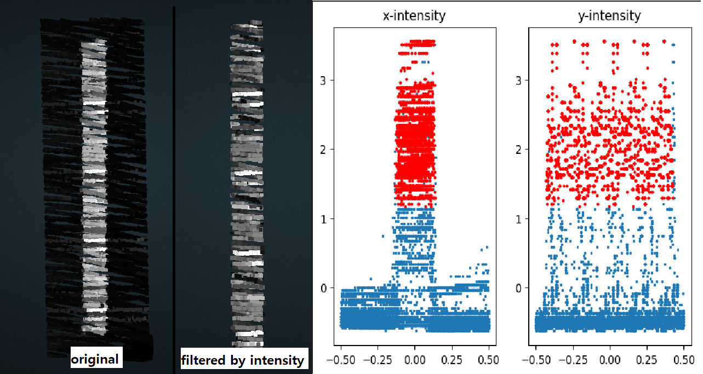
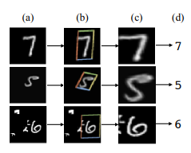
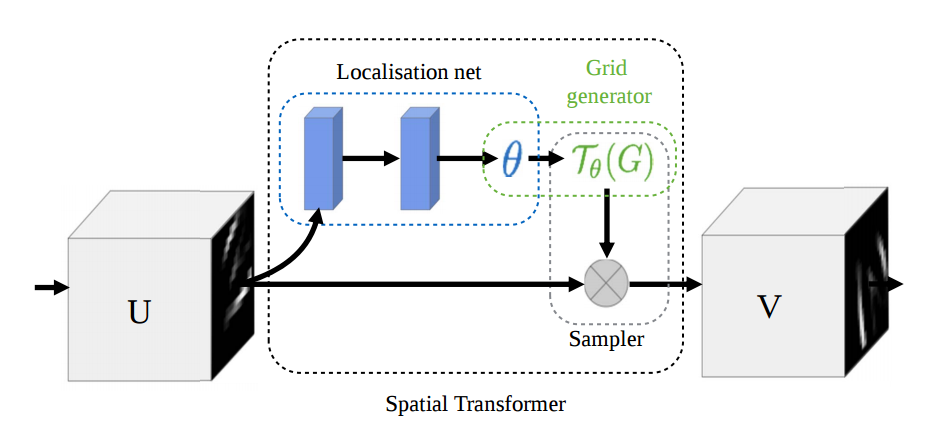
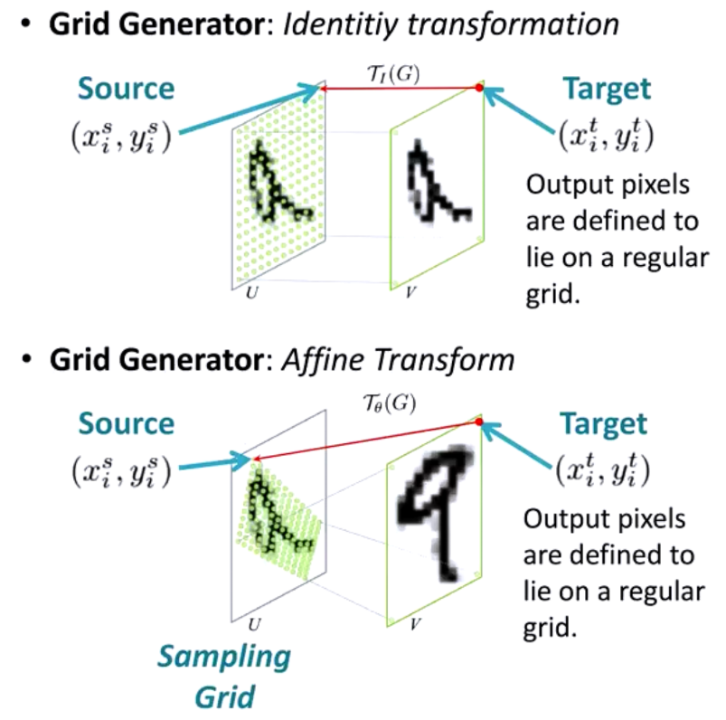
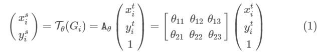
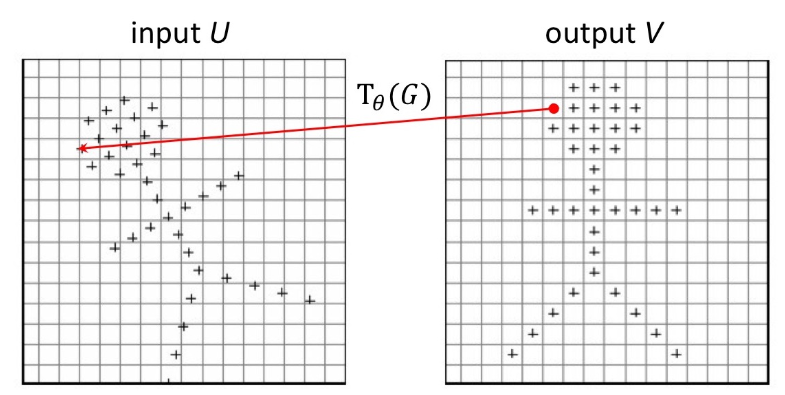
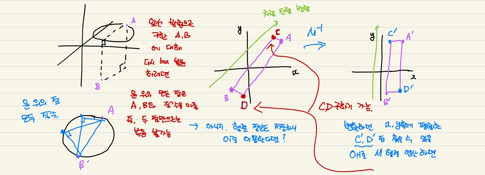

## [PointNet](https://github.com/charlesq34/pointnet)

## intensity를 통한 road marking 분석
>HDMap 제작을 위해 road marking(아스팔트 위에 그려져 있는 것들)을 탐지하는 방법으로 lidar의 intensity를 생각해봤다. road marking에 대한 intensity에 대해 threshold를 지정하여 filtering을 하였을 때 사진과 같은 데이터를 추출할 수 있고 이를 분포로 확인하면 아래 그림과 같다.

 
 
## STN
T-Net을 이해하기 위해 그 발상의 근원이 된 STN(spatial transformation network)을 먼저 봐야할 것 같다. 

CNN은 scale, rotation, tranlation과 같은 공간상의 변화에 제대로 탐지하지 못한다. CNN이 max pooling을 통해 spatial invariance를 어느정도 가지게 되지만 더 보완해야 한다. 그래서 등장했다.

변형을 준 MNIST data의 적합한 형태를 찾아 가장 적합한 형태를 추적한다. 

### localisation
input으로 cnn feature map을 받아 feature map에 적용된 affine transformation matrix theta를 추정한다. 
* cnn이나 fc layer로 구성가능하다.
* 마지막단에 regression layer로 두어 transformation parameter theta를 추정해야 한다.

(미국에서는 localization 영국에서는 localisation 이라고 한단다. 같은 의미)

### grid generator 
localisation으로 추정한 theta를 이용하여 원래 coordiantes의 grid에 위치를 대입? 한다. (어찌 하는지 코드로 이따 봐야겠음)
* theta의 파라미터가 미분 가능하기만 하면 해당 transformation은 다 표현 가능하다고 한다.

2d affine transform이면 2x3 행렬로 scale, rotation, trainslation, skew, cropping등 표현 가능하다.

### sampler
input인 feature map과 gird를 이용하여 bilinear interpolation을 진행해 output feature map을 생성한다.

* 위에서 생성한 grid에서 input U가 output V의 어느 위치에 매핑될지 정보 가진다.
* bilinear interpolation은 미분 가능해서 모델의 원하는 위치에 (이론상) 몇개든 넣을 수 있다. (그런데 CNN의 입력 바로 앞에 배치하는 것이 일반적이란다.)

### 구현

## Train dataset 복원
> 생성한 train dataset에 대해 복원하는 방법은 아래와 같다. 변환 후 x, y, z가 최대 최소값을 가지는 point의 원 좌표를 저장한 값이 min max 이므로, min max를 matrix의 역행렬로 변환한 후 x, y축과 평행이 되는 육면체를 만들고 나서, matrix를 이용해 원 좌표로 복원하면 된다.
 

 지금 저장된 결과값의 행렬이 역행렬 T로 저장되어 있는ㄴ듯!!! 확인해보삼!! 백타임;
 그리고 변환된 x, y, z의 min max를 구한다음에 마지막에 해당 min max에 대해서 다시 복구시킨 min max x, y, z를 저장해야함!!!