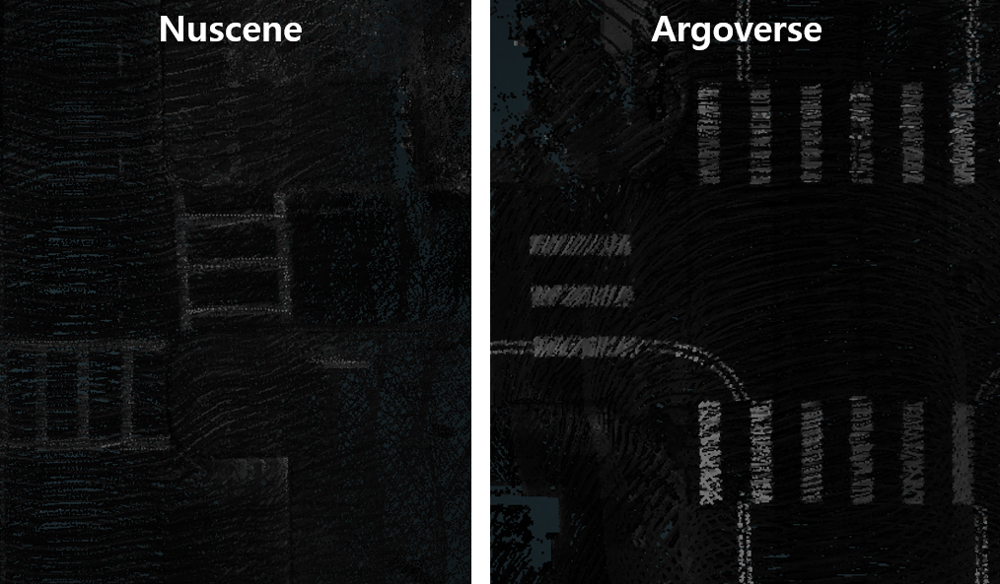
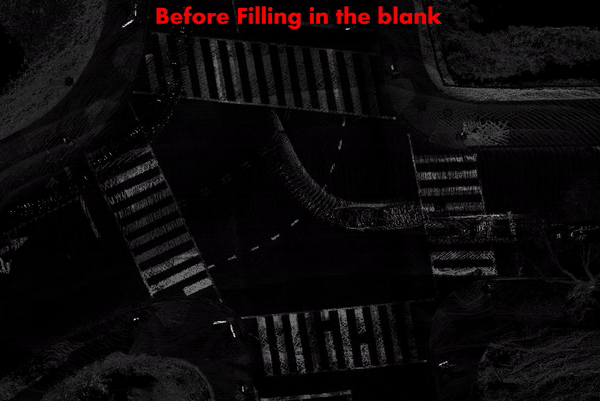
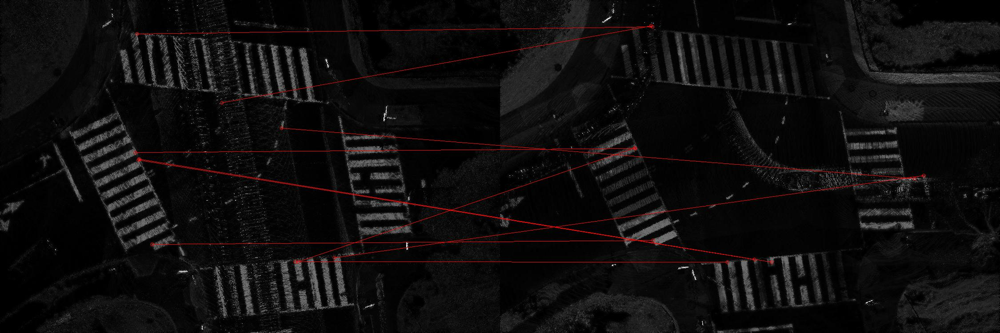

# [HDCorr](https://github.com/yeti-s/HDCorr)
```
HD Map 제작을 위한 Point Cloud 측위 오차 보정 자동화
```
MMS(Mobile Mapping System) 장비를 이용하여 수집한 데이터를 센서 캘리브레이션을 통해 고정밀 도로 지도(HD Map)를 제작할 수 있다. 하지만 이 과정에서 동일한 공간을 촬영한 데이터에도 측위 오차가 발생하여 이를 보정해 줄 필요가 있다. HD Corr는 딥 러닝을 이용하여 Point Cloud의 측위 오차를 자동 보정하는 방법을 연구한다.
<br>
<br> 2D 이미지 데이터에서 Change Detection이라는 Task와 이를 위한 많은 모델이 존재한다.  이를 변형하여 3D Point Cloud에서 Same Area Detection이라는 Task를 수행한다. 생각처럼 잘 되진 않겠지만 이를 통해 Computer Vision 분야의 경험치를 쌓을 수 있다고 예상한다.

## 기존 보정 방식

동일한 공간을 서로 다른 시간에 촬영한 데이터를 보면 IMU 센서에 의한 오차로 인해 point들이 어느정도 차이가 나는 것을 볼 수 있다. 전체 HD Map을 제작하기 위해 이를 Translation과 Interpolation을 통해 데이터를 보정한다.

## 파이프라인
* Feature Detection And Matching
    1. Point Cloud의 Bird's Eye View
    2. Feature Detecting
    3. Feature Matching
    4. Metric Learning
* 
    1. Point cloud 샘플링
    2. 
* Point cloud 샘플링
    * Road Marking Segmentation (Camera Image)
* 동일 도로 노면 감지
    * Metric Learning
    * 동일 부분 감지

## 데이터 선택
도로 노면 정보를 이용하여 측위 오차 보정을 위해 높은 채널수의 라이다 센서를 필요로 한다. 또한 개인으로 진행하는 프로젝트이기 때문에 적당한 볼륨의 데이터를 선택해야 한다. 

### [Apolloscape](https://apolloscape.auto/index.html)
Apolloscape는 Lane Segmentation, Scene Parsing, Detection/Tracking 등 다양한 Task를 위한 데이터셋을 제공하고 있다. 특히 Lane Segmentation 데이터를 활용하여 카메라 이미지에서 Road Marking Segmentation 모델을 학습할 수 있고, 라이다 Projection을 통한 Point Cloud 샘플링을 진행할 수 있다고 예상하였다. 하지만 HD Map 제작을 위한 raw 데이터를 제공하지 않아 센서 캘리브레이션을 수행할 수 없었다.

### [Nuscene](https://www.nuscenes.org/nuscenes)
기존 MMS 촬영 장비와 최대한 비슷한 환경을 가진 Nuscene 데이터를 채택했었다. 하지만 라이다의 채널과 카메라의 초당 프레임이 정밀한 지도를 만들기에 충분하지 않다고 판단하였다. 동일 사이트에 Nuplan 이라는 더 많은 센서를 이용해 촬영한 데이터가 존재하는데 개인 프로젝트로 진행하기에는 너무 큰 규모이기 때문에 고려하지 않았다.

### [Argoverse2](https://www.argoverse.org/av2.html)
이미 데이터가 어느정도 정제되었지만 Rotation, Translation과 같은 캘리브레이션을 위한 정보도 함께 제공되어 적합하다고 판단하였다. 또한 더 많은 채널의 라이다와 더 높은 초당 카메라 이미지 수를 가지고 있어 Nuscene 보다 더 정밀한 지도를 만들 수 있다고 생각하여 위 데이터를 채택하였다.  


## 지리 공간 표시
IMU 정보를 가진 Ego Vehicle 데이터를 이용하여 GeoJSON 형식으로 촬영된 지리 공간을 웹에서 Openlayers API를 활용해 표시할 수 있도록 한다. Ego Vehicle의 Translation 값은 각 도시의 Original 좌표 기준 미터 단위의 Offset을 나타낸다.


## 데이터 구조
AV2 데이터셋은 아래 6개의 도시에서 수집되었다.
* Austin, Texas: 31 logs.
* Detroit, Michigan: 117 logs.
* Miami, Florida: 354 logs.
* Pittsburgh, Pennsylvania: 350 logs.
* Palo Alto, California: 22 logs.
* Washington, D.C.: 126 logs.

AV2의 Sensor 데이터는 아래와 같은 폴더 구조를 가진다
```
|-- Root Directory
    |
    |-- [data id]
    |   |-- annotations.feather
    |   |-- city_SE3_egovehicle.feather
    |   |-- calibration
    |       |-- egovehicle_SE3_sensor.feather
    |       |-- intrinsics.feather
    |   |-- map
    |       |-- [data id]___img_Sim2_city.json
    |       |-- [data id]_ground_height_surface____[city name].npy
    |       |-- log_map_archive_[data id]____[city name]_city_[city id].json
    |   |-- sensors
    |       |-- cameras
    |           |-- ring_front_center
    |               |-- [time_stamp].jpg
    |               |-- ...
    |           |-- ...
    |       |-- lidar
    |           |-- [time_stamp].feather
    |           |-- ...
    |   |-- potree (캘리브레이션을 통해 생성할 데이터)
    |       |-- [data id].las
    |       |-- hierarchy.bin
    |       |-- log.txt
    |       |-- metadata.json
    |       |-- octree.bin
    |-- ...
```


캘리브레이션 하여 생성한 Point Cloud 데이터를 .las 형식의 파일로 저장하고 [Potree](https://github.com/potree/potree)를 이용하여 이를 시각화 할 것이다.

## 센서 캘리브레이션

### 라이다 캘리브레이션
AV2 데이터셋은 두 개의 32 Channel Lidar를 이용하여 하나의 64 Channel Lidar처럼 사용하였다. Up Lidar와 Down Lidar에 대한 Sensor Calibration을 제공하지만 Point Cloud는 이미 두 Lidar를 융합하여 Ego Vehicle의 좌표계로 변환해 둔 데이터를 제공하기에 쓸 일이 없다.


### 카메라 캘리브레이션


## 동일한 도로 노면 표시 감지


# Feature Detection And Matching

### 1. Bird's Eyes View
카메라 이미지를 Point Cloud 데이터에 Projection 하였을 때 오차가 발생한다. 따라서 조금 더 정확한 이미지로 Feature Detection을 하기 위해 Point Cloud 데이터를 Bird's Eyes View 이미지로 만들도록 하였다. Point Cloud는 Sparse한 특성을 가지고 있기 때문에 이미지 형태로 변환할 때 비어있는 Pixel에 대해 주변 값들의 평균을 내어 값을 채워주었다. 


사실 도로 위에 촬영 당시 지나가던 자동차와 행인등 여러가지 Noise가 존재하기 때문에 Worm's Eyes View로 제작하려 하였지만 동일 Pixel값을 가지는 Points중 가장 작은 z좌표를 가지는 포인트를 채택하는 방법은 큰 연산량을 요구하여서 조금 더 최적화가 필요할 것 같다.

또한 x, y 좌표가 Pixel로(integer) Quantization되기 때문에 어느정도 오차를 감수해야 한다. 이를 보완하는 방법 역시 생각해야 할 것 같다.

### 2. Feature Detection
FAST(Features from Accelerated Segment Test) 알고리즘과 BIREF(BInary Robust Independent Elementary Features) 알고리즘을 합친 ORB(Oriented FAST and Rotated BIREF) 알고리즘을 이용하여 Feature Detection을 수행한다.


Edge가 아닌 부분도 Feature로 검출된 것을 볼 수 있다. Point Cloud의 Sparse한 특성으로 도로 노면에 존재하는 모든 

### 3. Feature Matching
서로 다른 시간에 동일한 공간을 촬영한 측위 오차가 존재하는 Point Cloud의 BEV 이미지에 ORB를 이용해 추출한 Feature들을 서로 Matching하였다. 



Top 10의 Matching중 유효한 Matching은 2개 뿐이었다. 아마 위에서 언급한 이유로 잘못된 Feature들이 검출되기 때문인 것 같다.


## Citation
```
 @INPROCEEDINGS { Argoverse2,
  author = {Benjamin Wilson and William Qi and Tanmay Agarwal and John Lambert and Jagjeet Singh and Siddhesh Khandelwal and Bowen Pan and Ratnesh Kumar and Andrew Hartnett and Jhony Kaesemodel Pontes and Deva Ramanan and Peter Carr and James Hays},
  title = {Argoverse 2: Next Generation Datasets for Self-driving Perception and Forecasting},
  booktitle = {Proceedings of the Neural Information Processing Systems Track on Datasets and Benchmarks (NeurIPS Datasets and Benchmarks 2021)},
  year = {2021}
}
@INPROCEEDINGS { TrustButVerify,
  author = {John Lambert and James Hays},
  title = {Trust, but Verify: Cross-Modality Fusion for HD Map Change Detection},
  booktitle = {Proceedings of the Neural Information Processing Systems Track on Datasets and Benchmarks (NeurIPS Datasets and Benchmarks 2021)},
  year = {2021}
}
```