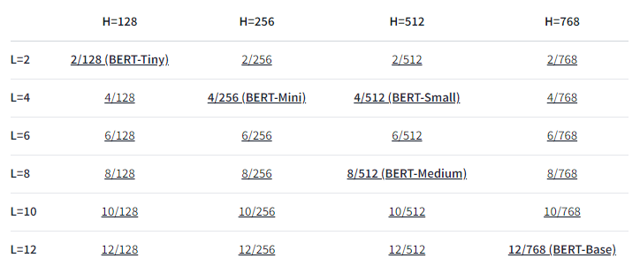

# BERT
BERT(Bidirectional Encoder Representations from Transformers)는 Google이 공개한 AI 언어 모델이다.
(transformer에 대해서는 추후에 다루겠다.)

BERT는 Layer와 Hidden state의 크기에 따라 종류가 다양하다.

그 중 나는 GPU의 한계로 인해 BERT-Small 모델에 대해 다룰 것이다.

# TorchScript & Pytorch JIT
모델을 production 하려면 두 가지가 필요하다.
1. Portabiliy
    * 모델이 다양한 환경에서 export 될 수 있어야 함
    * Python interpreter process 뿐만 아니라 mobile, embedded등 여러 환경에서 작동 가능해야 함
2. performance
    * inferenece latency와 throughput 모두의 성능을 유지하면서 최적화를 해야함

Pytorch는 위 두 가지 측면을 해결하기 위해 Torchscript는 코드를 Eager mode에서 Script Mode로 변환한다.

## Tools to Transition from Eager to Script
Eager Mode
* normal python runtime mode로 prototyping, traning, experimenting을 위해 사용된다.

Script Mode
* production deployment를 위해 변환한 모드
* runtime 과정에서 python interpreter로 실행되지 않기 떄문에 병렬 연산, 최적화등이 가능해진다.

