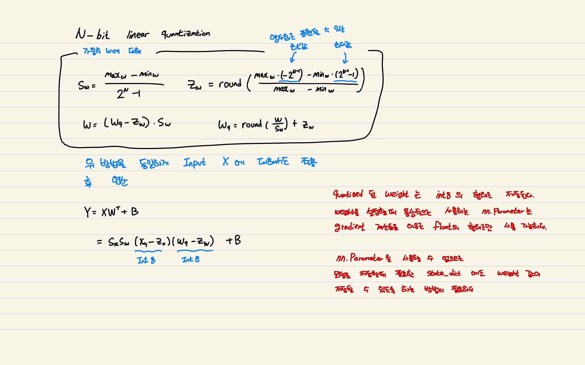

## Linear Quantization

Input X와 weight W에 대해서 linear quantization을 진행한 후 matmul연산으로 int8 형태의 연산을 수행한 후 scale 값을 곱하여 다시 float32 형태로 돌리는 방식으로 구현하였다.

통상적으로 weight의 class인 nn.Parameter는 gradient 계산을 위해 int형태로 사용될 수 없다. 따라서 int8로 quantized된 weight을 저장하기 위해 register_buffer를 사용한다. 

int8 형태의 tensor인 quantized된 weight은 gradient 계산이 필요 없으므로 모델 매개 변수로 간주되지 않는 버퍼로 등록하여 모델 저장을 위해 state_dict() 함수를 사용할 때 int8 형태의 weight tensor를 함께 저장할 수 있다.

## Weight Quantization

[Weighted-Entropy-based Quantization for Deep Neural Networks](https://openaccess.thecvf.com/content_cvpr_2017/papers/Park_Weighted-Entropy-Based_Quantization_for_CVPR_2017_paper.pdf) 논문을 참고하여 구현하였다.

