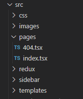

## **프레임워크 선정**

추후에 three.js를 이용하여 point cloud 데이터를 visualization 하는 기능을 추가하기 위해 기존에 익숙하였던 React 프레임워크로 개발을 진행하려 하였다. 그러다 정적 사이트 생성이 가능하고 React를 기반으로 하는 [Gatsby](https://www.gatsbyjs.com/) 라는 프레임워크를 알게 되었다. 이를 github pages와 함께 활용하면 markdown 파일 작성만으로 페이지를 쉽게 생성할 수 있을 것이다.

튜토리얼을 따라하며 기본적인 사용 방법을 익혔다. Gatsby는 기본적으로 src/pages에 있는 React 파일을 pages로 생성한다.



위 사진처럼 작성할 시 404와 index 페이지가 생성된다.

Gatsby에서는 query를 통해 데이터를 가져올 수 있다. 아래와 같이 query를 요청하고 props로 받아올 수 있다.
```typescript
    // 요청한 query에 대해 props로 받는다
    const IndexPage = ({ data }: PageProps<QueryProps>) => {
        const html = data.markdownRemark.html
    }

    export const query = graphql
    `{
        markdownRemark() {
            html
            frontmatter {
                title
                date
                categories
                summary
            }
        }
    }`
```

개발 단계에서 query에 대한 테스트는 [localhost:8000/___graphql](http://localhost:8000/___graphql) 에서 할 수 있다.


테스트로 gh-pages로 deploy를 진행하였더니 404 에러가 발생하였다. 원인을 찾은 결과 local에서는 https://localhost:8000 으로 접속하였으나, gh-pages 이용해 배포한 환경은 [https://yeti-s.github.io/blog](https://yeti-s.github.io/blog)로 항상 repository name이 붙어있다. 따라서 gatsby-config으로 path prefix 설정을 해주었다.

```typescript
// gatsby-config.ts
const config: GatsbyConfig = {
    ...
    pathPrefix: "/blog"
    ...
}
// package.json
"scripts": {
    ...
    "build": "gatsby build --prefix-paths",
    "serve": "gatsby serve --prefix-paths",
}
```

build와 serve에 각각 설정해준 --prefix-paths 옵션을 함께 추가하고 배포를 진행하여 문제를 해결할 수 있었다. 

사실 gatsby-config에 siteMetadata라는 옵션을 함께 설정해주었으나, 설정 값이 pathPrefix와 충돌이 있는 것인지 webpack.js 요청을 실패하는 경우가 발생하여 siteMetadata 옵션을 제거하였다.

## **템플릿**

Gatsby에서는 다양한 [템플릿](https://www.gatsbyjs.com/starters/)을 제공하였다. 템플릿을 이용해 프로젝트를 생성할 수 있었다.

```typescript
$ gatsby new [프로젝트명] [템플릿 주소]
```

그러나 템플릿의 대부분이 node v16 까지만 지원하는 것이 많았다. 블로그에 알맞는 템플릿을 찾던 중, node v18을 지원하는 [rocketdocs](https://github.com/jpedroschmitz/rocketdocs)라는 템플릿을 발견하였다. 기존 목적인 markdown 파일 작성만으로 페이지 생성을 쉽게 할 수 있고 docs 형식으로 프로젝트 진행 중 학습한 내용, 진행 과정 등을 남기기 좋을 것 같아 채택해보았다. 하지만 customize하기 어렵다는 문제가 있었다. 대부분의 템플릿에 해당하는 문제였기에 템플릿을 포기하고 직접 구현하기로 하였다.

## **페이지 생성**

Gatsby는 src/pages에 tsx파일을 page로 생성한다고 하였다. 그럼 .md 파일을 작성할 때 마다 tsx파일을 생성해야 하는가? 다행이도 Gatsby에는 프로그램적으로 페이지를 생성하는 방법이 있다.

[Part 6: Create Pages Programmatically](https://www.gatsbyjs.com/docs/tutorial/getting-started/part-6/)

1. gatsby-transformer-remark 플러그인을 설치한다.
   ```
   npm i gatsby-transformer-remark
   ```
2. gatsby-config에서 gatsby-transformer-remark 플러그인을 설정한다.
   ```typescript
    // gatsby-config.ts
    const config: GatsbyConfig = {
        ...
        resolve: "gatsby-transformer-remark",
        option:{
            ... // gatsby-transformer-remark 관련 플러그인
        }
    }
   ```
3. template 파일을 생성
    ```typescript
    // 생성할 페이지의 react element
    const IndexPage = ({ data }: PageProps<QueryProps>) => {
        const node = data.markdownRemark
        ...
    }

    // id는 gatsby-node.ts에서 받아옴 아래 보면 알게됨
    export const query = graphql
    `query($id: String!) {
        markdownRemark(id:{ eq: $id }) {
                html
                frontmatter {
                    title
                    date
                    categories
                    summary
                }
        }
    }`
    ```

    frontmatter의 객체는 .md 파일에서 아래 key 값들에 해당한다.
    ```
    ---
    title: 'Gatsby and React'
    date: '2023-05-15'
    categories: ['blog', 'gatsby', 'dev']
    summary: 'Blog 1일차 개발 일지.'
    thumbnail: '../assets/icon.png'
    menu: 'blog'
    path: '/yeti_blog/intro'
    ---
    ```

4. root dir에 gatsby-node.ts 파일을 생성한다.
    ```typescript
    import { GatsbyNode, graphql } from "gatsby";
    import {resolve} from 'path'

    const createPages: GatsbyNode["createPages"] = async ({graphql, actions}) => {
        const {createPage} = actions;

        // markdown 파일에 대해 query 요청
        const result = await graphql<any>(`
        {
            allMarkdownRemark {
                edges {
                    node {
                        id
                        frontmatter {
                            path
                        }
                    }
                }
            }
        }
        `);

    result.data.allMarkdownRemark.edges.forEach(({node}: any) => {
            createPage({
                // page의 path가 되는 부분
                path: node.frontmatter.path, 
                // 생성할 page의 template
                component: resolve('./src/templates/MdContents.tsx'),
                // 템플릿에 전달할 내용들
                context:{
                    id: node.id
                }
            })
            
        })

    }

    export {createPages}
    ```
위 방법으로 contents 폴더에 있는 .md 파일을 읽고 페이지로 생성한다.